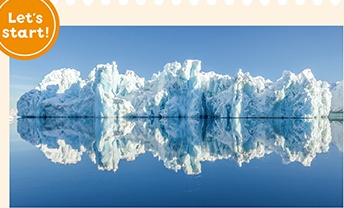

1章4 物質の状態

# 1節 物質の三態

 
# A 状態変化とエネルギー

 
復習

復習

復習

個々の物質の融点や沸点の高低の違いは, どのような要因から生じるのだろうか。

すべての物質には、固体,液体,気 体の3つの状態が存在し、粒子のふる まい方で状態が変化する。この状態変 化を、エネルギーの面から説明できな いだろうか。

◀グリーンランドの氷山

 
●融解 一定の圧力のもとで固体を加熱すると、ある温度で融けて液体になる。この現 象を融解といい,融解が起こる温度を融点という。

純物質の固体では、融解が始まってから完全に液体になるまでの間は、温度は一定にな る。これは、加えた熱エネルギーが状態変化だけに使われるためである。融点で、固体 1 molが融解するとき吸収される熱エネルギーの量\(熱量\)を融解熱という。水\(氷\)の融 解熱は6.01 kJ/molである\(図11\)。 \+p.93

●凝固 液体を冷却すると、ある温度で固体になる。この現象を凝固といい、凝固が起 こる温度を凝固点という。純物質の凝固点は融点に等しい。

こる温度を凝固点という。純物質の凝固点は融点に等しい。 液体1molが凝固するとき、融解熱と等しい熱量\(凝固熱\)が放出される。

\+p.93

●蒸発 液体から気体になる現象を蒸発という。また、液体が沸騰する温度を沸点とい う。一方、気体から液体になる現象を凝縮という。

液体から分子が蒸発するときには、液体から熱を奪うので液体の温度が下がる。液体1 mol が蒸発するとき吸収される熱量を蒸発熱という。100°Cでの水の蒸発熱は40.7 kJ/molであ る\(図12\)。気体1molが凝縮するときには、蒸発熱に等しい熱量\(凝縮熱\)が放出される。 $p.93

5

20

10

15

10

1編1章 物質の状態
